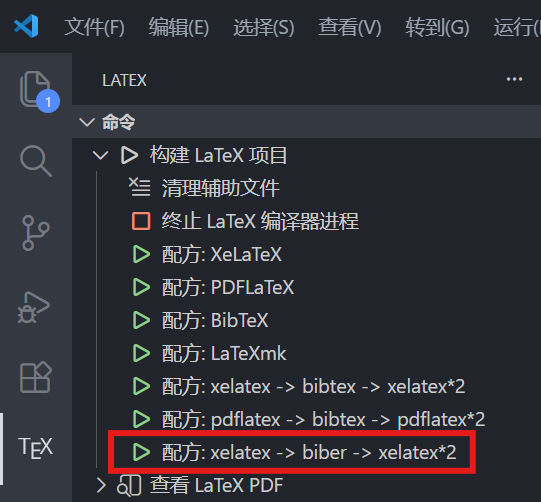

# 浙江大学管理学院本科毕业论文 LaTeX 模板操作指北

## 1. 环境准备与编译说明

### 1.1 软件环境

在 Windows 上，推荐使用以下组合：

* **TeX 发行版**: [TeX Live](https://www.tug.org/texlive/) 或 [MiKTeX](https://miktex.org/)。
* **编辑器**: [VS Code](https://code.visualstudio.com/) (配合 LaTeX Workshop 插件) 或 [TeXStudio](https://www.texstudio.org/)。
* 可参考这篇[知乎教程](https://zhuanlan.zhihu.com/p/166523064)
    其中6.1节的LaTeX配置代码可用下面这段：
    ```json
    "latex-workshop.latex.autoBuild.run": "never",
    "latex-workshop.showContextMenu": true,
    "latex-workshop.intellisense.package.enabled": true,
    "latex-workshop.message.error.show": false,
    "latex-workshop.message.warning.show": false,
    "latex-workshop.latex.tools": [
        {
            "name": "xelatex",
            "command": "xelatex",
            "args": [
                "-synctex=1",
                "-interaction=nonstopmode",
                "-file-line-error",
                "%DOCFILE%"
            ]
        },
        {
            "name": "pdflatex",
            "command": "pdflatex",
            "args": [
                "-synctex=1",
                "-interaction=nonstopmode",
                "-file-line-error",
                "%DOCFILE%"
            ]
        },
        {
            "name": "latexmk",
            "command": "latexmk",
            "args": [
                "-synctex=1",
                "-interaction=nonstopmode",
                "-file-line-error",
                "-pdf",
                "-outdir=%OUTDIR%",
                "%DOCFILE%"
            ]
        },
        {
            "name": "bibtex",
            "command": "bibtex",
            "args": [
                "%DOCFILE%"
            ]
        },
        {
            "name": "biber",
            "command": "biber",
            "args": [
                "%DOCFILE%"
            ]
        }
    ],
    "latex-workshop.latex.recipes": [
        {
            "name": "XeLaTeX",
            "tools": [
                "xelatex"
            ]
        },
        {
            "name": "PDFLaTeX",
            "tools": [
                "pdflatex"
            ]
        },
        {
            "name": "BibTeX",
            "tools": [
                "bibtex"
            ]
        },
        {
            "name": "LaTeXmk",
            "tools": [
                "latexmk"
            ]
        },
        {
            "name": "xelatex -> bibtex -> xelatex*2",
            "tools": [
                "xelatex",
                "bibtex",
                "xelatex",
                "xelatex"
            ]
        },
        {
            "name": "pdflatex -> bibtex -> pdflatex*2",
            "tools": [
                "pdflatex",
                "bibtex",
                "pdflatex",
                "pdflatex"
            ]
        },
        {
            "name": "xelatex -> biber -> xelatex*2",
            "tools": [
                "xelatex",
                "biber",
                "xelatex",
                "xelatex"
            ]
        }
    ],
    "latex-workshop.latex.clean.fileTypes": [
        "*.aux",
        "*.bbl",
        "*.blg",
        "*.idx",
        "*.ind",
        "*.lof",
        "*.lot",
        "*.out",
        "*.toc",
        "*.acn",
        "*.acr",
        "*.alg",
        "*.glg",
        "*.glo",
        "*.gls",
        "*.ist",
        "*.fls",
        "*.log",
        "*.fdb_latexmk",
        "*.bcf",
        "*.run.xml"
    ],
    "latex-workshop.latex.autoClean.run": "onFailed",
    "latex-workshop.latex.recipe.default": "lastUsed",
    "latex-workshop.view.pdf.internal.synctex.keybinding": "double-click",
    ```

### 1.2 编译方式

由于模板使用了 `biblatex` 进行参考文献管理，且包含中文支持，**必须**按照以下顺序进行编译：

1. **XeLaTeX**: 编译主文档，生成辅助文件 (`.aux`, `.bcf` 等)。
2. **Biber**: 处理参考文献，生成 `.bbl` 文件。
3. **XeLaTeX**: 再次编译，将参考文献插入文档。
4. **XeLaTeX**: 最后编译，确保页码和引用跳转正确。


**VS Code 配置提示**: 默认的 `Recipe: latexmk (xelatex)` 通常会自动处理这个流程。如果手动配置，确保工具链包含 `biber`。

---

## 2. 个人信息与文档模式配置

所有核心配置都在根目录下的 **`zjuthesis.tex`** 文件中。请打开该文件进行如下修改：

### 2.1 填写个人信息

找到 `\documentclass` 中的设置块 ，按照如下格式填写：

```latex
\documentclass[
    % ... 其他设置 ...
    StudentName     = 张三,          % 你的姓名
    StudentID       = 3220100000,    % 你的学号
    AdvisorName     = 李四,          % 指导教师姓名
    Grade           = 2022,          % 年级 (只写年份)
    Major           = 信息管理与信息系统, % 专业全称
    Department      = 管理学院, 
    SubmitDate      = 递交日期,
    Title           = 你的中文论文题目,
    % ...
]{zjuthesis}
```

`StudentName`和`AdvisorName`字段正常填写名字即可，若名字只有两字也不用留空，命令`\FormatStudentName`和`\FormatAdvisorName`会进行格式化。

若论文题目需要两行，使用下面这行代码：
```latex
\titletwolines{填第一行}{填第二行}
```

### 2.2 切换开题报告 (Proposal) 与 最终论文 (Final)

通过修改 `Period` 参数来控制当前是撰写“开题报告”还是“最终论文” ：

* **开题报告阶段**: 设置 `Period = proposal`。此时编译出的文档将只包含开题报告所需的封面、综述、正文等。
* **最终论文阶段**: 设置 `Period = final`。此时编译出的文档将包含完整的毕业论文结构（承诺书、致谢、目录、正文等）。

---

## 3. 页面组织与内容撰写

模板采用模块化结构，内容文件主要存放在 `body/` 文件夹中。

### 3.1 目录结构

* `zjuthesis.tex`: 主控文件。
* `body/`: 存放具体章节内容的文件夹。
* `body/undergraduate/proposal/`: **开题报告**的内容（综述、开题正文等）。
* `body/undergraduate/final/`: **最终论文**的内容（摘要、各章节）。
* `body/ref.bib`: **参考文献**数据文件。


* `figure/`: 存放图片文件。

### 3.2 组织章节

在 `zjuthesis.tex` 的 `\inputundergraduate` 定义中，你可以看到文件的加载顺序 。

* **如果正在写 Final**:
    你需要关注 `body/undergraduate/final/` 下的文件:
    - **新建章节文件**：
        例如，要写“**引言**”这一章节时，可以新建一个名为`1-introduction.tex`的文件（文件名可自定义），在该`tex`文件中编辑正文内容：

        ```latex
        \cleardoublepage % 双面打印，确保新章节从右侧奇数页开始

        \section{引言}
        这里是一级标题内容......

        \subsection{二级标题}
        这里是二级标题内容......

        \subsubsection{三级标题}
        这里是三级标题内容......
        ```
    - **在主控文件中注册**：
        `body/undergraduate/final/content.tex` 是正文内容入口，你可以在该文件中使用 `\inputbody`  拆分导入各个章节，例如：
        ```latex
        % 在 body/undergraduate/final/content.tex 中:
        \inputbody{final/1-introduction}
        \inputbody{final/2-body}
        % ...
        ```
        *Remark*：只需导入正文相关章节即可，`body/undergraduate/final/`下的`3-appendix.tex`、`4-cv.tex`等`tex`文件不需导入。 
<br>

* **如果正在写 Proposal**:
    关注 `body/undergraduate/proposal/` 下的文件:
    - **文献综述**：`review`文件夹
        自行新建`tex`文件编辑综述内容，`review.tex`是内容入口，使用`\inputbody`导入章节。
    - **开题报告**：`proposal`文件夹
        自行新建`tex`文件编辑开题内容，`proposal.tex`是内容入口，使用`\inputbody`导入章节。
    - **外文翻译**：`translation`文件夹
        自行新建`tex`文件编辑翻译内容，`translation.tex`是内容入口，使用`\inputbody`导入章节。
    - **外文原文**：`original`文件夹
        在`original.tex`文件中修改如下代码块：
        ```latex
        \includepdf[
            pages=-,     % '1-10'表示导入1-10页，'-'表示导入全部页
            scale=0.72,  % 缩放比例
            pagecommand={\pagestyle{fancy}},
            frame,       % 带边框，若不需要边框，删掉这行
        ]{paper.pdf}     % pdf文件名称
        ```
        *Remark*：原文pdf文件可放在`figure/`文件夹下。

---

## 4. 数学环境
* 定义
  ```latex
  \begin{definition}[具体名称]
      ...
  \end{definition}
  ```
* 定理
  ```latex
  \begin{theorem}[具体名称]
      ...
  \end{theorem}
  ```
* 引理
  ```latex
  \begin{lemma}[具体名称]
      ...
  \end{lemma}
  ```
* 命题
  ```latex
  \begin{proposition}[具体名称]
      ...
  \end{proposition}
  ```
* 推论
  ```latex
  \begin{corollary}[具体名称]
      ...
  \end{corollary}
  ```
* 性质
  ```latex
  \begin{property}[具体名称]
      ...
  \end{property}
  ```
* 假设
  ```latex
  \begin{assumption}[具体名称]
      ...
  \end{assumption}
  ```
* 例
  ```latex
  \begin{example}[具体名称]
      ...
  \end{example}
  ```
* 注
  ```latex
  \begin{remark}[具体名称]
      ...
  \end{remark}
  ```
* 证明
  ```latex
  \begin{proof}
      ...
  \end{proof}
  ```

---

## 5. 引用文献与图片

### 5.1 引用文献 (使用 BibLaTeX)

1. **添加数据**: 打开 `body/ref.bib` 文件 ，将你的参考文献 BibTeX 数据粘贴进去。
    * 参考文献需要一点手动设置（没辙了 sad~）；
    * 如果涉及到多位作者（>1），需要有`author`和`shortauthor`两个字段，键值为希望在文中呈现的效果（`author`呈现在参考文献中，`shortauthor`呈现在正文引用中），“`&`”前需加反斜杠“`\`”转义，键值用“`{{}}`”包裹表示强制原样输出；必须要有`langid`字段：`english` or `chinese`。
        ```latex
        % [1] 期刊
        @article{ref1,
            author      = {{Aporgan, R. M., \& Hunt, S. D.}},
            shortauthor = {{Aporgan \& Hunt}},
            title       = {The commitment-trust theory of relationship marketing},
            journal     = {Journal of Marketing},
            year        = {1994},
            volume      = {58},
            number      = {3},
            pages       = {20-38},
            langid      = {english}
        }

        % [2] 专著
        @book{ref2,
            author      = {{Beck, C. A. J., \& Sales, B. D.}},
            shortauthor = {{Beck \& Sales}},
            title       = {Family mediation: Facts, myths, and future prospects},
            address     = {Washington, DC},
            publisher   = {American Psychological Association},
            year        = {2001},
            pages       = {10-12},
            langid      = {english}
        }

        % [3] 学位论文
        @thesis{ref3,
            author      = {毛华森},
            title       = {模块化专业课程计划的研究与开发},
            institution = {浙江大学},
            year        = {1989},
            type        = {硕士学位论文},
            langid      = {chinese}
        }
        ```
        *Remark*: 谷歌学术或百度学术均可导出 BibTeX 格式；paper官网一般也可导出 BibTex格式。

1. **正文引用**:
   * **句末引用** : 使用 `\citepy`；
   * **句内引用** : 使用 `\citety`。
        ```latex
        \citepy{ref1}       % 单篇引用 效果：（Aporgan & Hunt, 1994）
        \citepy{ref1, ref2} % 多篇引用 效果：（Aporgan & Hunt, 1994; Beck & Sales, 2001）
        \citety{ref1}       % 单篇引用 效果：Aporgan & Hunt（1994）
        ```
        *Remark*：句内引用只支持单篇引用；正文引用后，参考文献章节会自动写入文献，不需要单独编辑；对于英文文献，若作者超过两位，`shortauthor`字段可写：
        ```latex
        shortauthor = {{FirstAuthor et al.}} % 当然，用“等”也可以，看个人喜好，不过要注意全文统一
        ```

### 5.2 插入图片

1. **存放位置**: 将图片文件（jpg, png, pdf 等）放入根目录下的 **`figure/`** 文件夹中。
2. **路径设置**: 模板在 `config/path.tex` 中已配置 `\graphicspath{{figure/}}` ，因此引用图片时**不需要**写 `figure/` 前缀。
3. **插入代码示例**:
    ```latex
    \begin{figure}[htbp]
        \centering
        % 假设 figure 文件夹里有个名为 model.pdf 的文件
        \includegraphics[width=0.8\textwidth]{model.pdf} 
        \caption{系统架构图}  % 图片名称
        \label{fig:arch}     % 用于引用，\autoref{fig:arch}
    \end{figure}

    \begin{figure}[htbp]
        \centering
        % 假设 figure 文件夹里新建了一个叫 image 的子文件夹，里面有个名为 model.png 的图片
        \includegraphics[width=0.8\textwidth]{image/model.png} 
        \caption{系统架构图}
        \label{fig:arch}
    \end{figure}
    ```

### 5.3 其他引用
在`config/format/general/reference.tex`中已配置图片、表格等引用格式：
```latex
\def\equationautorefname        {式}
\def\footnoteautorefname        {脚注}
\def\figureautorefname          {图}
\def\tableautorefname           {表}
\def\partautorefname            {篇}
\def\chapterautorefname         {章}
\def\sectionautorefname         {节}
\def\subsectionautorefname      {小节}
\def\subsubsectionautorefname   {小小节}
\def\paragraphautorefname       {段落}
\def\subparagraphautorefname    {子段落}
\def\appendixautorefname        {附录}
\def\FancyVerbLineautorefname   {行}
\def\definitionautorefname      {定义}
\def\theoremautorefname         {定理}
\def\lemmaautorefname           {引理}
\def\propositionautorefname     {命题}
\def\corollaryautorefname       {推论}
\def\assumptionautorefname      {假设}
\def\exampleautorefname         {例}
\def\propertyautorefname        {性质}
\def\remarkautorefname          {注}
\def\lstlistingname             {代码}
\def\algorithmname              {算法}
\def\algorithmcfname            {算法}
\def\algorithmautorefname       {算法}
\def\algotocloftname            {算法}
```
具体用法及效果：
```latex
\autoref{fig}    % 图+图编号, e.g., 图 1.1
\autoref{tab}  % 表+表编号
\autoref{def}    % 定义+序号
% ...以此类推
```
由于公式一般包裹在括号中，不适用`\autoref`，可手打“式”结合`\eqref`进行引用。

---

## 6. 其他配置（宏包、字体与样式）

### 6.1 添加宏包

如果你需要使用额外的 LaTeX 宏包（例如画图包 `tikz`），请在 **`config/packages.tex`** 文件中添加 `\usepackage{...}` 。

* *建议*: 尽量加在这个文件中，保持主文件整洁。

### 6.2 Windows 下的字体配置

模板在 Windows 下默认使用项目文件夹 `fonts/` 目录下的字体文件，而不是系统安装的字体，以保证跨设备一致性。

* **配置文件**: `config/format/general/fonts.tex` 。
* **必要操作**: `fonts/` 文件夹内包含以下文件（模板包中自带）：
  * `simfang.ttf` (仿宋)
  * `simhei.ttf` (黑体)
  * `simkai.ttf` (楷体)
  * `simsun.ttc` (宋体)
  * `STFangsong.TTF` (华文仿宋)
  * `STXingkai.TTF`  (华文行楷)
  * `FangSong_GB2312.ttf` (仿宋_GB2312)
  * `times.ttf`, `timesbd.ttf`, `timesbi.ttf`, `timesi.ttf` (Times New Roman)
* **如何调整**: 如果你想用系统字体，需要启用 `fonts.tex`中的如下代码段（在模板中已注释）：
  ```latex
  % 系统导入字体
  \setCJKfamilyfont{zhfs}   {FangSong} [AutoFakeBold={\FakeBoldSize}]
  \setCJKfamilyfont{zhhei}  {SimHei}   [AutoFakeBold={\FakeBoldSize}]
  \setCJKfamilyfont{zhkai}  {KaiTi}    [AutoFakeBold={\FakeBoldSize}]
  \setCJKfamilyfont{zhsong} {SimSun}   [AutoFakeBold={\FakeBoldSize}]
  \setCJKfamilyfont{hwfs} {STFangsong} [AutoFakeBold={\FakeBoldSize}]
  \setCJKfamilyfont{xingkai} {STXingkai} [AutoFakeBold={\FakeBoldSize}]
  \setCJKfamilyfont{zhfsgb} {FangSong_GB2312} [AutoFakeBold={\FakeBoldSize}]
  
  \setCJKmainfont[AutoFakeBold={\FakeBoldSize}]{FangSong}

  \setmainfont{Times New Roman}
  ```
  必须确保设备中已安装`仿宋_GB2312`字体，并把每个字体设置语句中第二个括号内的名称改成自己设备字体文件中的名称，Windows系统下字体文件一般存在`C:\Windows\Fonts`目录下。然后把如下代码段注释掉：
  ```latex
  \defaultfontfeatures{Path = fonts/}
    
  % 仿宋 (SimFang)
  \setCJKfamilyfont{zhfs} {simfang.ttf} [AutoFakeBold={\FakeBoldSize}]
    
  % 黑体 (SimHei)
  \setCJKfamilyfont{zhhei} {simhei.ttf} [AutoFakeBold={\FakeBoldSize}]
    
  % 楷体 (KaiTi)
  \setCJKfamilyfont{zhkai} {simkai.ttf} [AutoFakeBold={\FakeBoldSize}]
    
  % 宋体 (SimSun)
  \setCJKfamilyfont{zhsong} {simsun.ttc} [AutoFakeBold={\FakeBoldSize}]
    
  % 华文仿宋 (STFangsong)
  \setCJKfamilyfont{hwfs} {STFangsong.TTF} [AutoFakeBold={\FakeBoldSize}]
    
  % 华文行楷 (STXingkai)
  \setCJKfamilyfont{xingkai} {STXingkai.TTF} [AutoFakeBold={\FakeBoldSize}]
    
  % 仿宋_GB2312 (FangSong_GB2312)
  \setCJKfamilyfont{zhfsgb} {FangSong_GB2312.ttf} [AutoFakeBold={\FakeBoldSize}]

  \setCJKmainfont[AutoFakeBold={\FakeBoldSize}]{simfang.ttf}

  \setmainfont{times.ttf}[
    Path = fonts/,
    BoldFont = timesbd.ttf,
    ItalicFont = timesi.ttf,
    BoldItalicFont = timesbi.ttf
  ]
  ```
  ***Remark*：Mac系统需要自行配置；最稳妥的方法是保持默认，不要动这个文件。**

### 6.3 样式修改

如果你需要修改页边距、标题格式或页眉页脚，请前往 **`config/format/general/`** 目录，如 `geometry.tex` 控制页边距，`heading.tex` 控制章节标题。

---

## 总结：从零开始的一步步操作

1. **准备**: 安装 TeX Live 和 VS Code。
2. **配置**: 打开 `zjuthesis.tex`，填好你的名字、学号、导师等信息。
3. **模式**: 如果是开题，设 `Period = proposal`；如果是写论文，设 `Period = final`。
4. **写作**:
   * 把图片丢进 `figure/`。
   * 把参考文献 BibTeX 贴进 `body/ref.bib`。
   * 在 `body/undergraduate/final/` (或 `proposal/`) 下对应的 `.tex` 文件里写正文。
5. **编译**: 运行 `XeLaTeX -> Biber -> XeLaTeX*2` 链条。
6. **检查**: 此时根目录下生成的 `zjuthesis.pdf` 即为你的论文文档。

---

**特别鸣谢：本模板由[ZJUTHESIS](https://thenetadmin.github.io/zjuthesis)改编而来。**

**本项目代码基于 MIT 协议开源。**

**学校标志与学校文件的版权归浙江大学和浙江大学管理学院所有。**